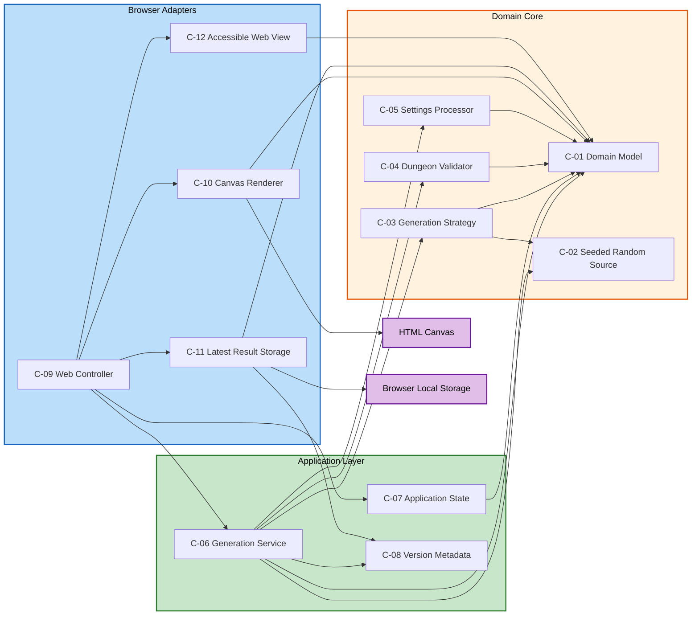
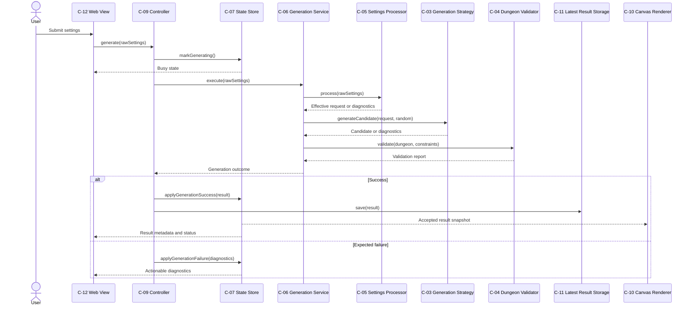

# Component Dependencies and Communication

## Dependency Rule

Dependencies point inward from browser adapters to application services and from application services to domain contracts. Domain components never import browser, Canvas, local-storage, view, controller, or framework code.

The selected main-thread topology changes where components execute, not the dependency direction: domain and application components remain free of browser API assumptions even though the initial deployment runs them in the browser process.

## Static Dependency Diagram

### Static Dependency Text Alternative

- C-09 coordinates C-06, C-07, C-10, C-11, and C-12.
- C-06 depends on domain types, seeded randomness, the generation strategy, the validator, the settings processor, and version metadata.
- C-03 depends on domain types and the seeded random source.
- C-04 and C-05 depend only on domain types.
- C-07, C-10, C-11, and C-12 consume domain or application contract types.
- C-10 alone accesses HTML Canvas.
- C-11 alone accesses browser-local storage and uses version metadata for compatibility.

## Dependency Matrix

`D` means the row component directly depends on the column component's contract. `E` means the row component accesses the external browser capability.

| From | C-01 | C-02 | C-03 | C-04 | C-05 | C-06 | C-07 | C-08 | C-09 | C-10 | C-11 | C-12 | Canvas | Local storage |
|---|---:|---:|---:|---:|---:|---:|---:|---:|---:|---:|---:|---:|---:|---:|
| C-01 Domain Model |  |  |  |  |  |  |  |  |  |  |  |  |  |  |
| C-02 Random Source |  |  |  |  |  |  |  |  |  |  |  |  |  |  |
| C-03 Generation Strategy | D | D |  |  |  |  |  |  |  |  |  |  |  |  |
| C-04 Dungeon Validator | D |  |  |  |  |  |  |  |  |  |  |  |  |  |
| C-05 Settings Processor | D |  |  |  |  |  |  |  |  |  |  |  |  |  |
| C-06 Generation Service | D | D | D | D | D |  |  | D |  |  |  |  |  |  |
| C-07 Application State | D |  |  |  |  |  |  |  |  |  |  |  |  |  |
| C-08 Version Metadata |  |  |  |  |  |  |  |  |  |  |  |  |  |  |
| C-09 Web Controller |  |  |  |  |  | D | D |  |  | D | D | D |  |  |
| C-10 Canvas Renderer | D |  |  |  |  |  |  |  |  |  |  |  | E |  |
| C-11 Latest Result Storage | D |  |  |  |  |  |  | D |  |  |  |  |  | E |
| C-12 Accessible Web View | D |  |  |  |  |  |  |  |  |  |  |  |  |  |

## Generation Data Flow

### Generation Data-Flow Text Alternative

1. The user submits raw settings through C-12.
2. C-09 marks C-07 busy and invokes C-06 after a browser render opportunity.
3. C-06 asks C-05 for an effective request, C-03 for candidates, and C-04 for validation.
4. C-06 returns a typed success or expected failure.
5. On success, C-09 updates C-07 and replaces the single C-11 local record; C-10 and C-12 consume the completed state.
6. On expected failure, C-09 records diagnostics in C-07 while preserving the previous valid result.

## Startup Restoration Data Flow

1. C-09 binds C-12 actions and subscribes C-10 and C-12 to C-07 state.
2. C-09 calls C-11 `load()`.
3. C-11 reads one fixed key, checks its version through C-08-compatible metadata, deserializes it, and validates its shape.
4. A valid record is applied atomically to C-07.
5. Absent data leaves defaults unchanged.
6. Malformed or incompatible data is discarded safely; startup continues with defaults.

## Communication Patterns

| Interaction | Pattern | Reason |
|---|---|---|
| View to controller | Direct synchronous command | Browser events have one coordinator and no distributed boundary |
| Controller to generation service | Synchronous typed request and response | Explicit user decision; main-thread topology selected |
| Generation service to domain components | Direct contract calls | Deterministic in-process orchestration |
| State to view and renderer | Snapshot subscription | Keeps presentation consistent without domain components knowing adapters |
| Controller to local repository | Synchronous best-effort adapter call | Browser-local API; failure does not invalidate current-session success |
| Expected failures | Typed result values | Keeps normal rule failures out of exception control flow |
| Unexpected faults | Exception to one error boundary | Separates programming or platform faults from expected diagnostics |

## Prohibited Couplings

- C-01 through C-08 must not import browser, DOM, Canvas, local-storage, or UI-framework modules.
- C-03 must not call C-04 or decide final acceptance.
- C-04 must not invoke generation, retries, rendering, or persistence.
- C-06 must not access controls, Canvas, or local storage.
- C-10 must not mutate a dungeon, settings, validation report, or application state.
- C-11 must not expose listing, history, accounts, synchronization, or arbitrary record keys.
- C-12 must not duplicate settings, generation, validation, or restoration business rules.
- No component may introduce unseeded randomness into deterministic generation.

## Test Seams Created by Dependencies

- C-06 can receive fake C-02 through C-05 and C-08 dependencies for orchestration tests.
- C-03 and C-04 can be property-tested without browser setup.
- C-09 can be tested with fake state, repository, renderer, and view adapters.
- C-11 serialization can be round-trip property-tested independently of actual local storage.
- C-10 can be tested against a controlled Canvas surface and known accepted result.

## Extension Compliance

The dependency design has no directly enforceable partial PBT rule at this stage. It preserves isolated seams for later PBT-02, PBT-03, PBT-07, PBT-08, and PBT-09 compliance. Security and Resiliency extensions remain disabled.
