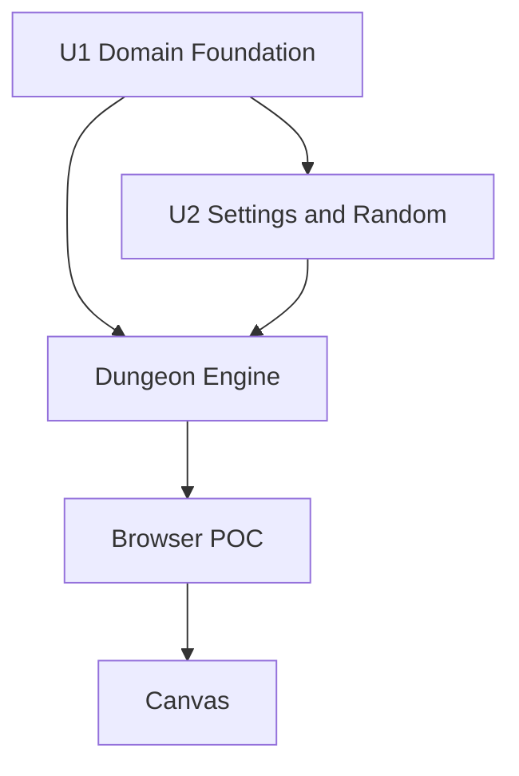

# POC Component Dependencies

## Text Alternative

- U1 is complete.
- U2 depends on U1 and is complete.
- Dungeon Engine depends on U1 and U2.
- Browser POC depends on Dungeon Engine and is the only Canvas user.

Browser POC calls Dungeon Engine synchronously with immutable settings or session values. Dungeon Engine returns immutable success or typed expected-failure outcomes.

## Content Validation

- Mermaid node IDs are alphanumeric.
- Labels contain no unescaped special characters.
- A text alternative is included.
