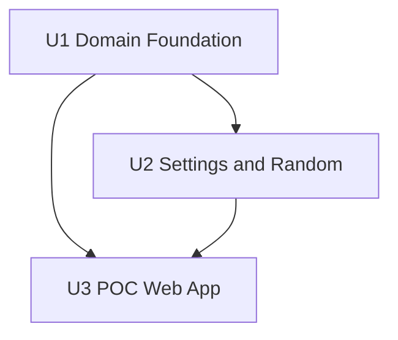

# POC Unit Dependencies

## Text Alternative

- U1 has no unit dependency.
- U2 depends on U1.
- U3 `poc-web-app` depends on both completed U1 and U2.
- No additional remaining unit exists.

## Dependency Matrix

`D` means the row unit depends on the column unit.

| From | U1 | U2 | U3 |
|---|---:|---:|---:|
| U1 domain-foundation |  |  |  |
| U2 deterministic-random-and-settings | D |  |  |
| U3 poc-web-app | D | D |  |

## Content Validation

- Mermaid node IDs use letters and digits only.
- Labels contain no unescaped special characters.
- A text alternative accompanies the diagram.
