# Execution Plan

## Detailed Analysis Summary

### Project Scope

- **Project type**: Greenfield
- **Transformation scope**: A complete new web application rather than a change to an existing component
- **Primary product areas**: Seeded dungeon generation, structural and playability validation, browser interaction, accessible visualization, automated testing, build quality, and deployment architecture
- **Requirements depth**: Comprehensive
- **User stories**: Ten approved stories organized around configure, generate, inspect, adjust, recover, and rely-on-product outcomes

### Change Impact Assessment

- **User-facing changes**: Yes — the complete configuration, generation, visualization, validation, metadata, regeneration, and recovery experience is new.
- **Structural changes**: Yes — the project needs clear boundaries among domain models, generation, validation, rendering, interaction state, and delivery concerns.
- **Data model changes**: Yes — new models are required for coordinates, tiles, rooms, corridors, entrance and exit, settings, constraints, results, validation diagnostics, and version metadata.
- **API changes**: Yes — new internal component contracts are required; whether a network API is needed remains a design decision.
- **NFR impact**: High — visual usability, WCAG 2.2 AA accessibility, determinism, performance, reliability, maintainability, web security fundamentals, property-based testing, and release quality affect design and verification.
- **Infrastructure impact**: Undetermined but material — the production-oriented goal requires a selected browser-delivery, hosting, CI, observability, and release model.

### Risk Assessment

- **Risk level**: High
- **Rollback complexity**: Easy during initial greenfield development; moderate after a hosted release exists
- **Testing complexity**: Complex because generated layouts must satisfy broad invariants over many seeds and settings while the UI also needs interaction and accessibility verification
- **Primary risks**:
  - Non-deterministic behavior undermining reproducibility
  - Constraint combinations causing excessive retries or no valid solution
  - Generation and rendering blocking the browser at supported limits
  - Visual behavior that is difficult to inspect or inaccessible
  - Premature stack or hosting choices coupling domain logic to the UI
  - Incomplete property-based generators or failure-seed reporting

## Phase Determination

### Completed or Skipped Inception Stages

| Stage | Status | Rationale |
|---|---|---|
| Workspace Detection | Completed | Established a greenfield repository with no application source or build system |
| Reverse Engineering | Skipped | No existing application code exists to analyze |
| Requirements Analysis | Completed | Comprehensive functional, non-functional, scope, and success requirements were approved |
| User Stories | Completed | One persona and ten INVEST-verified stories with traceability were approved |
| Workflow Planning | Review | This execution plan is complete and awaiting approval |

### Recommended Remaining Stages

| Stage | Decision | Depth | Rationale |
|---|---|---|---|
| Application Design | Execute | Comprehensive | New domain, validation, rendering, interaction, and delivery components need defined responsibilities and contracts |
| Units Generation | Execute | Comprehensive | The work contains multiple cohesive areas, complex algorithms, new data models, and cross-unit dependencies |
| Functional Design | Execute per unit | Comprehensive for generation and validation; standard where logic is simpler | Deterministic algorithms, topology rules, constraints, state transitions, and failure behavior require explicit design |
| NFR Requirements | Execute per applicable unit | Comprehensive | The stack, performance limits, accessibility verification, security fundamentals, PBT framework, and operational targets remain undecided |
| NFR Design | Execute per applicable unit | Comprehensive | Selected NFR patterns must be incorporated into component and runtime design |
| Infrastructure Design | Execute per applicable unit | Standard initially, deepening where a hosted component is selected | Hosting, CI, browser delivery, observability, and release architecture are required for the production-oriented outcome |
| Code Generation | Execute per unit | Adaptive by unit | AI-DLC always requires an approved implementation plan followed by code and tests |
| Build and Test | Execute | Comprehensive | Integration, accessibility, property-based, browser, performance, security, and release checks must be documented and run |
| Operations | Placeholder | N/A | The current AI-DLC Operations stage has no executable workflow |

## Workflow Visualization

```mermaid
flowchart TD
    Start(["User Request"])

    subgraph INCEPTION["INCEPTION PHASE"]
        WD["Workspace Detection<br/><b>COMPLETED</b>"]
        RE["Reverse Engineering<br/><b>SKIPPED</b>"]
        RA["Requirements Analysis<br/><b>COMPLETED</b>"]
        US["User Stories<br/><b>COMPLETED</b>"]
        WP["Workflow Planning<br/><b>REVIEW</b>"]
        AD["Application Design<br/><b>EXECUTE</b>"]
        UG["Units Generation<br/><b>EXECUTE</b>"]
    end

    subgraph CONSTRUCTION["CONSTRUCTION PHASE"]
        FD["Functional Design<br/><b>EXECUTE</b>"]
        NFRA["NFR Requirements<br/><b>EXECUTE</b>"]
        NFRD["NFR Design<br/><b>EXECUTE</b>"]
        ID["Infrastructure Design<br/><b>EXECUTE</b>"]
        CG["Code Generation<br/><b>EXECUTE</b>"]
        BT["Build and Test<br/><b>EXECUTE</b>"]
    end

    subgraph OPERATIONS["OPERATIONS PHASE"]
        OPS["Operations<br/><b>PLACEHOLDER</b>"]
    end

    Start --> WD
    WD --> RE
    RE --> RA
    RA --> US
    US --> WP
    WP --> AD
    AD --> UG
    UG --> FD
    FD --> NFRA
    NFRA --> NFRD
    NFRD --> ID
    ID --> CG
    CG --> BT
    BT --> OPS
    OPS --> End(["Complete"])

    style WD fill:#4CAF50,stroke:#1B5E20,stroke-width:3px,color:#fff
    style RE fill:#BDBDBD,stroke:#424242,stroke-width:2px,stroke-dasharray:5 5,color:#000
    style RA fill:#4CAF50,stroke:#1B5E20,stroke-width:3px,color:#fff
    style US fill:#4CAF50,stroke:#1B5E20,stroke-width:3px,color:#fff
    style WP fill:#FFA726,stroke:#E65100,stroke-width:3px,stroke-dasharray:5 5,color:#000
    style AD fill:#FFA726,stroke:#E65100,stroke-width:3px,stroke-dasharray:5 5,color:#000
    style UG fill:#FFA726,stroke:#E65100,stroke-width:3px,stroke-dasharray:5 5,color:#000
    style FD fill:#FFA726,stroke:#E65100,stroke-width:3px,stroke-dasharray:5 5,color:#000
    style NFRA fill:#FFA726,stroke:#E65100,stroke-width:3px,stroke-dasharray:5 5,color:#000
    style NFRD fill:#FFA726,stroke:#E65100,stroke-width:3px,stroke-dasharray:5 5,color:#000
    style ID fill:#FFA726,stroke:#E65100,stroke-width:3px,stroke-dasharray:5 5,color:#000
    style CG fill:#4CAF50,stroke:#1B5E20,stroke-width:3px,color:#fff
    style BT fill:#4CAF50,stroke:#1B5E20,stroke-width:3px,color:#fff
    style OPS fill:#BDBDBD,stroke:#424242,stroke-width:2px,stroke-dasharray:5 5,color:#000
    style Start fill:#CE93D8,stroke:#6A1B9A,stroke-width:3px,color:#000
    style End fill:#CE93D8,stroke:#6A1B9A,stroke-width:3px,color:#000
    style INCEPTION fill:#BBDEFB,stroke:#1565C0,stroke-width:3px,color:#000
    style CONSTRUCTION fill:#C8E6C9,stroke:#2E7D32,stroke-width:3px,color:#000
    style OPERATIONS fill:#FFF59D,stroke:#F57F17,stroke-width:3px,color:#000

    linkStyle default stroke:#333,stroke-width:2px
```

### Text Alternative

1. Workspace Detection — completed.
2. Reverse Engineering — skipped because the repository is greenfield.
3. Requirements Analysis — completed and approved.
4. User Stories — completed and approved.
5. Workflow Planning — awaiting review.
6. Application Design — execute.
7. Units Generation — execute.
8. For each unit, execute applicable Functional Design, NFR Requirements, NFR Design, and Infrastructure Design.
9. For each unit, execute Code Generation planning and generation.
10. Execute comprehensive Build and Test after all units are complete.
11. Operations remains a placeholder.

## Execution Sequence

### INCEPTION PHASE

- [x] Workspace Detection — completed
- [x] Reverse Engineering — skipped as not applicable
- [x] Requirements Analysis — completed and approved
- [x] User Stories — completed and approved
- [ ] Workflow Planning — plan generated, awaiting approval
- [ ] Application Design — execute after workflow-plan approval
- [ ] Units Generation — execute after Application Design approval

### CONSTRUCTION PHASE

- [ ] Functional Design — execute for each applicable unit
- [ ] NFR Requirements — execute for each applicable unit
- [ ] NFR Design — execute after NFR Requirements for each applicable unit
- [ ] Infrastructure Design — execute for each unit requiring runtime or delivery mapping
- [ ] Code Generation — always execute for each unit
- [ ] Build and Test — always execute after all units

### OPERATIONS PHASE

- [ ] Operations — placeholder; no executable stage currently exists

## Coordination Strategy

- **Approach**: Sequential across approval gates, with per-unit implementation ordered by dependencies after Units Generation.
- **Expected critical path**: Domain models and deterministic generation contracts, then validation contracts, then web interaction and visualization, followed by delivery integration.
- **Coordination points**: Shared dungeon and settings models, deterministic seed contract, validation-result contract, render model, version metadata, and build/test configuration.
- **Testing checkpoints**: Per-unit example and property tests; generation-validation integration; UI interaction and accessibility checks; full browser workflow; supported-limit performance; final build and release checks.
- **Rollback strategy**: Keep units independently testable and checkpoint approved artifacts and code in version control before dependent units advance.

The exact unit boundaries and dependency graph will be decided during Units Generation rather than assumed here.

## Estimated Workflow

- **Remaining executable stages**: 8 stage types, repeated per unit where applicable
- **Approval model**: Explicit review at Application Design, Units Generation, each conditional per-unit design stage, Code Generation planning and completion, and Build and Test
- **Calendar estimate**: Deferred until the technology stack and unit decomposition are approved; a time estimate before those decisions would be unreliable

## Success Criteria

- **Primary goal**: Deliver the approved production-oriented visual dungeon generator with deterministic, validated layouts.
- **Key deliverables**: Application and component designs, unit decomposition, per-unit functional and NFR designs, infrastructure mapping, working application code, automated tests, and build-and-test instructions.
- **Quality gates**:
  - Approved artifacts at every required AI-DLC checkpoint
  - Traceability from requirements through stories, units, design, code, and tests
  - Determinism and dungeon invariants verified over generated inputs
  - Property-based tests using domain generators, shrinking, and replayable seeds
  - Example-based tests for critical user workflows
  - Accessibility and browser interaction verification
  - Measured supported-limit generation and rendering performance
  - Repeatable build, static checks, and release-oriented verification

## Extension Compliance

| Extension or rule | Status for Workflow Planning | Rationale |
|---|---|---|
| Security Baseline | Skipped | Disabled by user selection |
| PBT-02, PBT-03, PBT-07, PBT-08, PBT-09 | N/A | These rules are not directly enforced during Workflow Planning; the plan schedules their decisions and verification in NFR Requirements, Functional Design, Code Generation, and Build and Test as applicable. |
| Resiliency Baseline | Skipped | Disabled by user selection |

No enabled extension has a blocking finding at this stage.
