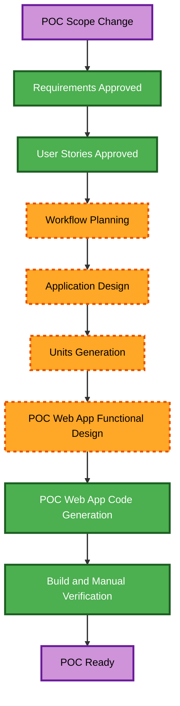

# POC Execution Plan

## Detailed Analysis Summary

### Change Impact Assessment

- **User-facing changes**: Yes. The POC retains one local browser journey for generation and maze play.
- **Structural changes**: Yes. The former seven remaining units will be consolidated into one POC unit after revised Application Design and Units Generation.
- **Data model changes**: No change to completed U1/U2 public foundations is required.
- **API changes**: Remaining interfaces will be simplified around in-memory generation, validation, and play.
- **NFR impact**: Production delivery, persistence, formal compliance, and future automated-test requirements are removed; local build and manual validation remain.

### Risk Assessment

- **Risk level**: Moderate.
- **Rollback complexity**: Moderate; the previous production-oriented requirements, stories, and execution plan are retained as superseded artifacts.
- **Testing complexity**: Simple for the remaining POC; manual acceptance checks plus preserved U1/U2 tests.

## Workflow Visualization

### Text Alternative

1. Complete revised Application Design and Units Generation.
2. Build the consolidated POC web-app unit.
3. Run the local build and manually verify the POC journey.

## Phases to Execute

### Inception

- [x] Workspace Detection — completed.
- [x] Reverse Engineering — skipped because the workspace is greenfield.
- [x] Requirements Analysis — POC revision approved.
- [x] User Stories — POC revision approved.
- [x] Workflow Planning — POC revision prepared.
- [x] Application Design — executed at standard depth; it defines two internal POC component boundaries in one unit.
- [x] Units Generation — executed at minimal depth; it replaces U3–U9 with one `poc-web-app` unit.

### Construction

- [ ] Functional Design — execute for `poc-web-app`; generation/play rules and browser interaction behavior need explicit boundaries.
- [ ] NFR Requirements — skip; the selected TypeScript, React, Vite, and Vitest local stack is already available, and no new production NFR is in scope.
- [ ] NFR Design — skip; no corresponding NFR Requirements stage executes.
- [ ] Infrastructure Design — skip; local browser execution has no infrastructure design requirement.
- [ ] Code Generation — execute for the single POC unit.
- [ ] Build and Test — execute; provide local build instructions and a manual POC verification checklist, preserving already-existing U1/U2 test commands.

### Operations

- [ ] Operations — placeholder and out of scope.

## Unit Sequence

1. Preserve U1 `domain-foundation` and U2 `deterministic-random-and-settings` as completed dependencies.
2. Design and build `poc-web-app`, containing the Dungeon Engine and Browser POC component boundaries in one unit.
3. Build locally and manually verify the complete POC journey.

## Success Criteria

- The workspace runs as a local browser application.
- A user can generate, inspect, navigate, complete, reset, and regenerate a deterministic dungeon without reloading.
- No persistence, hosting, deployment, release automation, or production compliance requirement is introduced.
- The former production workflow artifacts remain available with `production-scope-superseded` names.

## Content Validation

- Mermaid node IDs use only letters; labels contain no unescaped quote or arrow character.
- The flowchart uses valid directed connections and a default link style.
- A numbered text alternative accompanies the flowchart.
