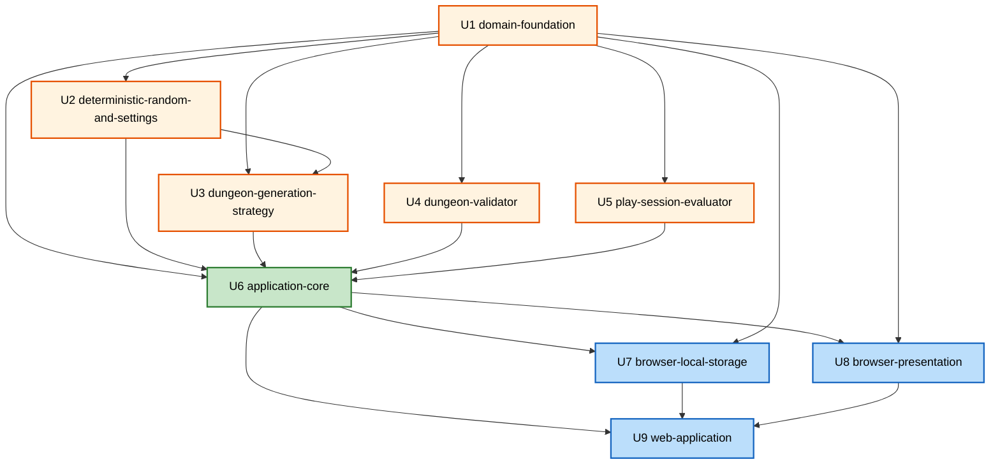

# Unit Dependencies

## Dependency Rule

Units follow the same inward dependency direction as the application design: domain units do not depend on browser units; generation and validation do not depend on presentation; the web shell depends on all integration units.

## Dependency Diagram

### Dependency Text Alternative

- U1 is the root unit and has no unit dependencies.
- U2, U4, and U5 depend only on U1 and can be built in parallel after U1.
- U3 depends on U1 and U2.
- U6 depends on U1 through U5.
- U7 and U8 depend on U6 and U1; they can be built in parallel after U6.
- U9 depends on U6, U7, and U8 and is the final integration unit.

## Dependency Matrix

`D` means the row unit depends on the column unit.

| From | U1 | U2 | U3 | U4 | U5 | U6 | U7 | U8 | U9 |
|---|---:|---:|---:|---:|---:|---:|---:|---:|---:|
| U1 domain-foundation |  |  |  |  |  |  |  |  |  |
| U2 deterministic-random-and-settings | D |  |  |  |  |  |  |  |  |
| U3 dungeon-generation-strategy | D | D |  |  |  |  |  |  |  |
| U4 dungeon-validator | D |  |  |  |  |  |  |  |  |
| U5 play-session-evaluator | D |  |  |  |  |  |  |  |  |
| U6 application-core | D | D | D | D | D |  |  |  |  |
| U7 browser-local-storage | D |  |  |  |  | D |  |  |  |
| U8 browser-presentation | D |  |  |  |  | D |  |  |  |
| U9 web-application |  |  |  |  |  | D | D | D |  |

## Critical Path

U1 → U2 → U3 → U6 → U8 → U9

U4 and U5 are on the critical path only through U6. U7 can be developed in parallel with U8 after U6 but must complete before U9.

## Parallelization Boundaries

| After unit completes | Safe parallel units |
|---|---|
| U1 | U2, U4, U5 |
| U2 | U3 |
| U6 | U7, U8 |

No unit may import implementation code from a later unit. Shared contracts from completed units may be consumed only through their published boundaries.

## Per-Unit Construction Sequence

After Units Generation approval, each unit follows the construction loop defined in the execution plan:

1. Functional Design when recommended
2. NFR Requirements when recommended
3. NFR Design when NFR Requirements executed
4. Infrastructure Design when recommended
5. Code Generation always

Recommended unit implementation order for the construction phase:

1. U1
2. U2, U4, U5 in parallel where team capacity allows
3. U3
4. U6
5. U7 and U8 in parallel where team capacity allows
6. U9
7. Build and Test after all units complete

## Extension Compliance

Partial Property-Based Testing rules are not directly enforced during Units Generation. Dependency boundaries preserve the required test seams for later enforcement. Security and Resiliency extensions remain disabled.
